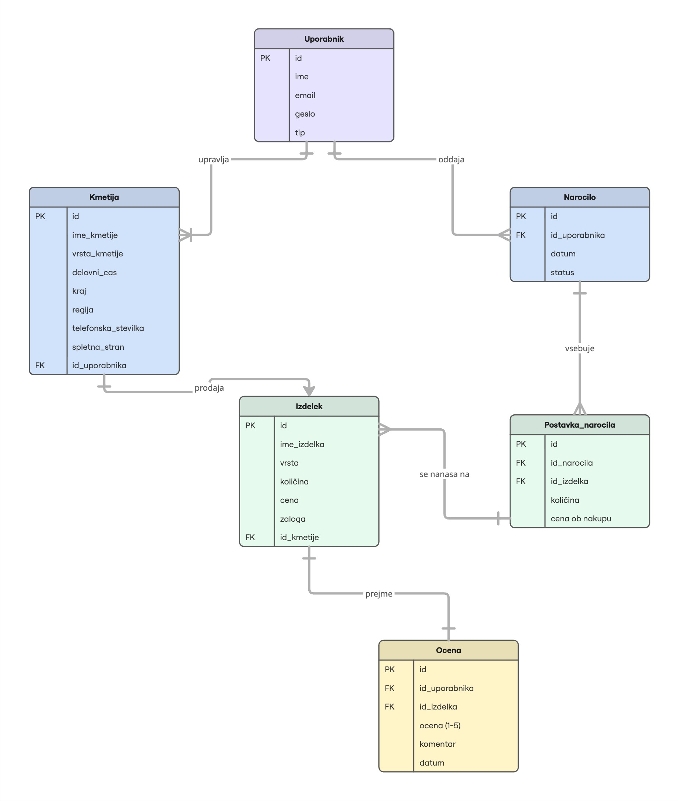

# 🥕 Lokalna tržnica — Spletna in tekstovna aplikacija za lokalne kmetije

Seminarska naloga pri predmetu **Podatkovne baze 1**.

Lokalna tržnica je napredna spletna tržnica, ki povezuje lokalne kmetije s kupci domačih izdelkov (med, sadje, zelenjava, mlečni izdelki, jajca in mesnine). Kmetije lahko podrobno predstavijo svojo ponudbo, kupci pa izdelke brskajo, filtrirajo po regijah ali vrstah, jih dodajajo v interaktivno košarico, oddajo naročilo in pridelke tudi ocenijo.

Aplikacija prikazuje celovito delo z relacijsko podatkovno bazo SQLite in ponuja **dva neodvisna vmesnika nad isto bazo**:
* **Spletni vmesnik** (`web.py`) – Grafična aplikacija, zgrajena s pomočjo ogrodja Flask.
* **Tekstovni vmesnik** (`cli.py`) – Hitro upravljanje podatkov in pregled napredne statistike neposredno iz terminala.

---

## 🗄️ Podatkovni model

Podatkovna baza (SQLite) je sestavljena iz šestih med seboj tesno povezanih tabel:

| Tabela | Opis |
|---|---|
| `Uporabnik` | Kupci, lastniki kmetij in administratorji (gesla so varno shranjena z uporabo zgoščevanja). |
| `Kmetija` | Podatki o posamezni kmetiji; vsaka kmetija pripada natanko enemu uporabniku (lastniku). |
| `Izdelek` | Ponudba kmetij (cena, pakiranje, trenutna zaloga). |
| `Narocilo` | Nakupovalne košarice in pretekla naročila s statusi (`kosarica`, `oddano`, `zakljuceno`, `preklicano`). |
| `Postavka_narocila` | Vezna tabela med naročilom in izdelkom (razrešitev relacije M:N). |
| `Ocena` | Ocene (1–5 zvezdic) in komentarji kupcev za posamezne izdelke. |

**Pregled relacij in celovitosti:**
* `Uporabnik` 1 : N `Kmetija`
* `Kmetija` 1 : N `Izdelek`
* `Uporabnik` 1 : N `Narocilo`
* `Narocilo` **M : N** `Izdelek` — Relacija je realizirana prek tabele `Postavka_narocila`, ki poleg količine hrani tudi **ceno ob nakupu**. S tem je zagotovljeno, da morebitna kasnejša sprememba cene izdelka ne popači finančne zgodovine starih naročil.
* `Uporabnik` **M : N** `Izdelek` — Prek tabele `Ocena`. Omejitev `UNIQUE (id_uporabnika, id_izdelka)` preprečuje, da bi isti kupec isti izdelek ocenil več kot enkrat.

Referenčno integriteto strogo varujejo tuji ključi (`PRAGMA foreign_keys = ON`):
* `ON DELETE RESTRICT`: Prepreči brisanje kmetije ali izdelka, ki je že del oddanega naročila, s čimer ohranimo neokrnjeno zgodovino.
* `ON DELETE CASCADE`: Ob izbrisu naročila samodejno počisti njegove pripadajoče postavke.

### ER diagram


---

## 🚀 Namestitev in zagon

Vsi spodnji ukazi se izvajajo iz **korena repozitorija**.

### 1. Priprava virtualnega okolja in namestitev knjižnic
```bash
python3 -m venv .venv
source .venv/bin/activate        # Windows terminal: .venv\Scripts\activate

pip install -r farm_system/requirements.txt
```

### 2. Inicializacija baze in uvoz testnih podatkov
Bazo podatkov vedno zgradimo na novo in jo napolnimo z vzorčnimi relacijskimi podatki iz CSV datotek z zaporednim zagonom:
```bash
# Ustvari prazno bazo in tabele (nastane farm_system/farm.db)
python3 farm_system/init_db.py

# Uvozi začetno stanje iz data/*.csv datotek
python3 farm_system/load_data.py
```

### 3. Zagon spletnega vmesnika (Flask)
```bash
python3 farm_system/web.py
```
Aplikacija bo dostopna v brskalniku na naslovu: **[http://127.0.0.1:5000](http://127.0.0.1:5000)**

### 4. Zagon tekstovnega vmesnika (CLI)
```bash
python3 farm_system/cli.py
```

---

## 🔑 Pripravljeni testni računi

Za hitro testiranje različnih nivojev pravic in transakcij so v bazi že na voljo naslednji uporabniki:

| Vloga | E-poštni naslov | Geslo |
|---|---|---|
| **Kupec** | `ana.kranjc@gmail.com` | `ana123` |
| **Lastnik kmetije** | `cene@med.si` | `cene123` |
| **Administrator** | `ziva.hribar@kmet.si` | `admin123` |

*Vsa gesla so v bazi shranjena varno s kriptografskim zgoščevanjem (`werkzeug.security`), zato jih v čistopisu ni mogoče prebrati.*

---

## ✨ Funkcionalnosti po vlogah

* **Neregistrirani obiskovalci:** Brskanje in iskanje izdelkov po imenu, vrsti ali kmetiji, filtriranje po regijah ter vpogled v splošno statistiko tržnice.
* **Kupec:** Upravljanje interaktivne košarice (dodajanje, spreminjanje količine, odstranjevanje), oddaja naročila s potrditvijo transakcije, pregled lastne zgodovine nakupov ter možnost ocenjevanja izdelkov (1–5 zvezdic + komentar).
* **Lastnik kmetije:** Nadzorna plošča *Moja kmetija* z ločenim pregledom svojih kmetij, artiklov in prejetih naročil. Omogoča dodajanje/urejanje/brisanje lastnih kmetij ter posodabljanje cen in zalog artiklov. Lastnik lahko potrjuje in zaključuje prejeta naročila.
* **Administrator:** Pregled celotnega seznama uporabnikov, spreminjanje tipov računov, brisanje računov (če niso vezani z RESTRICT omejitvijo) ter polne administrativne pravice nad vsemi kmetijami, izdelki in ocenami na tržnici.

---

## 🧠 Uporabljeni SQL koncepti

Da bi zadostili vsem zahtevam in kriterijem naprednega dela s podatkovnimi bazami, projekt implementira:
* **DDL z omejitvami:** `PRIMARY KEY AUTOINCREMENT`, `FOREIGN KEY`, `NOT NULL`, `UNIQUE`, `DEFAULT` ter `CHECK` omejitve (npr. preverjanje dovoljenih tipov uporabnikov, statusov naročil in dolžine vnosov).
* **Zahtevnejša stikanja (JOIN):** Uporaba `INNER JOIN` in `LEFT JOIN` poizvedb (vključno s stikanjem čez pet tabel hkrati za sestavo pregleda prejetih naročil za določenega kmetovalca).
* **Agregacijske funkcije:** Ukazi `COUNT`, `SUM`, `AVG` in `ROUND` v kombinaciji z `GROUP BY` in `HAVING` za dinamični preračun statistik (najbolj prodajani izdelki, promet po posameznih kmetijah, povprečne ocene artiklov).
* **Varnost in parametrizacija:** Vse poizvedbe so striktno parametrizirane z uporabo placeholderjev (`?`).

---

## 📁 Struktura projekta

Koda je strogo razdeljena po arhitekturnem vzorcu **MVC (Model-View-Controller)**. Vsa SQL koda se nahaja izključno v sloju modela, medtem ko sta oba vmesnika popolnoma neodvisna od predstavitve podatkov v bazi.

```text
Lokalne-kmetije/
├── README.md                # Ta dokumentacija
├── LICENSE                  # Licenčna datoteka
├── er_diagram.jpg          # Konceptualni (Chen) ER diagram
└── farm_system/
    ├── database.py          # Nizkonivojski sloj (povezava, query() / execute() in transakcije)
    ├── model.py             # MODEL: Edini modul v aplikaciji, ki vsebuje SQL poizvedbe in poslovno logiko
    ├── web.py               # KRMILNIK: Spletni Flask vmesnik (upravljanje sej, POST/Redirect/GET)
    ├── cli.py               # KRMILNIK: Tekstovni terminalski vmesnik za delo z bazo
    ├── init_db.py           # Skripta za brisanje in kreiranje praznih tabel po shemi
    ├── load_data.py         # Skripta za samodejen uvoz začetnih stanj iz CSV datotek
    ├── schema.sql           # SQL DDL: Definicija tabel, CHECK omejitev in indeksov
    ├── requirements.txt     # Seznam potrebnih zunanjih knjižnic
    ├── data/                # Začetno relacijsko stanje (6 CSV datotek)
    ├── static/
    │   └── style.css        # Celotna grafična podoba spletne aplikacije
    └── templates/           # POGLEDI: Jinja2 predloge z dedovanjem (base.html) in delnimi predlogami (partials/)
```